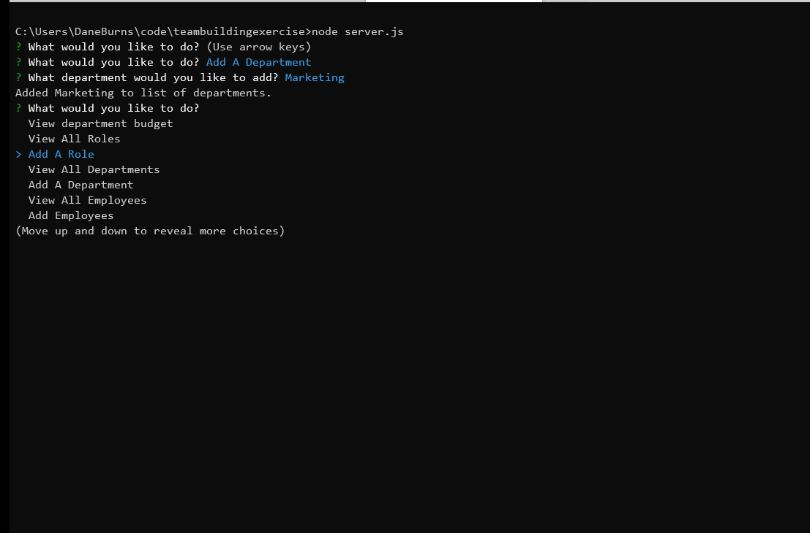
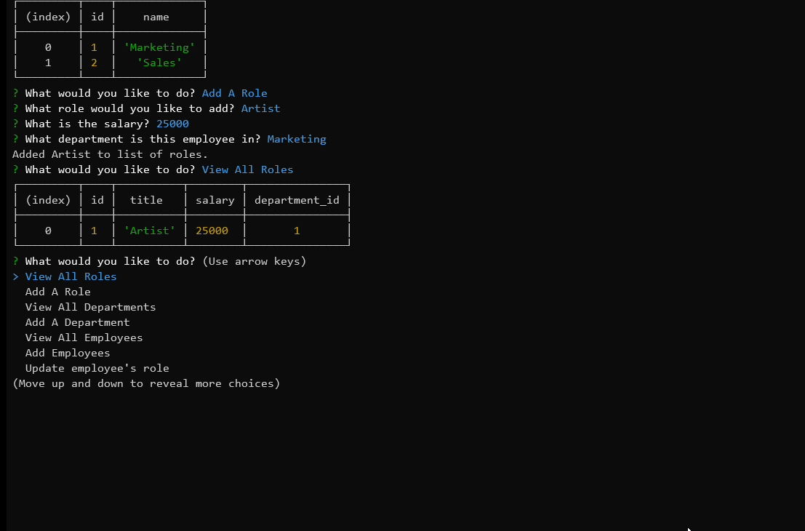
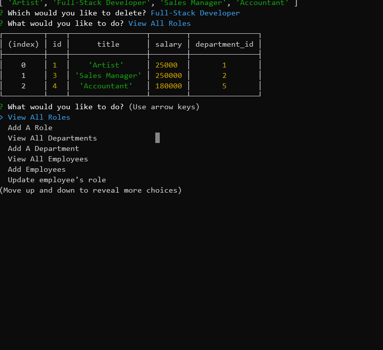

# Team Builder

#### Team builder is a Node.js CLI driven application that allows you to manage roles, departments, employees and managers.

## Functionality Demo

### Add/View Department

### Add/View Employee

### Add/View Roles

### Delete Department

### Delete Employee

### Delete Role

### Update Manager

### Update Role

### View Total Budget of A Department

### View Employees by Manager

